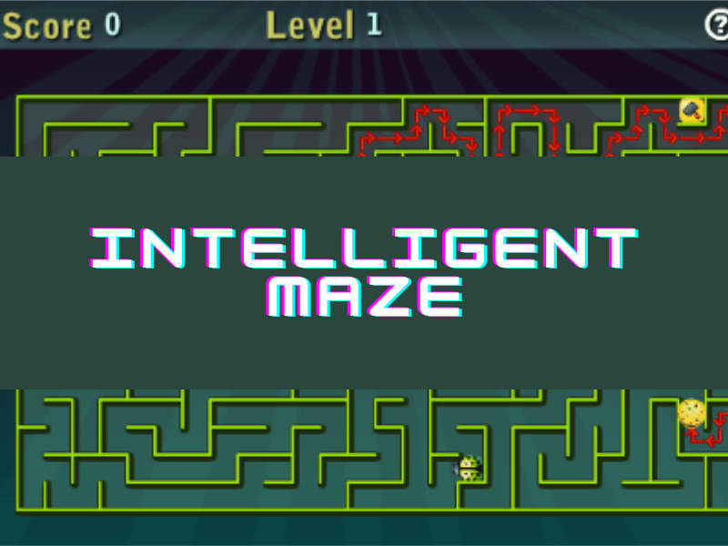
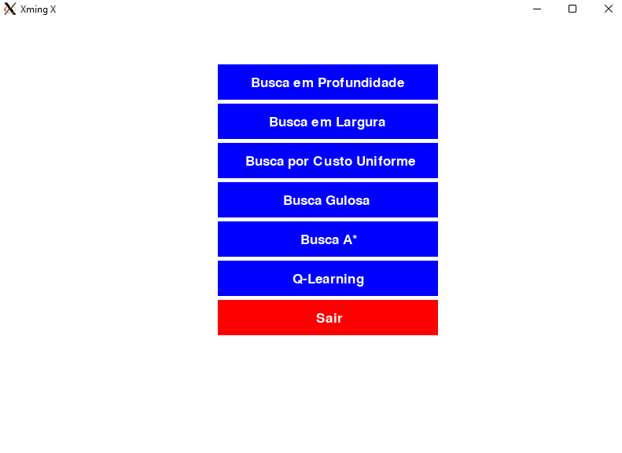

## Running AI-Maze-Game with Docker and Xming on Windows

This guide provides step-by-step instructions for running the AI-Maze-Game application using Docker and Xming on a Windows machine.

### Prerequisites

Before you begin, make sure you have the following installed:

- Docker: [Install Docker for Windows](https://docs.docker.com/docker-for-windows/install/)
- Xming: Xming-6-9-0-31-setup.exe

### Instructions

1. Install Xming by running the `Xming-6-9-0-31-setup` installer.
2. Open a terminal where the Dockerfile is located.
3. Build the Docker image by running the following command: `docker build -t projetoia .`
4. Run the Docker container with Xming by running the following command: `docker run -it --name projetoia -e DISPLAY=host.docker.internal:0 projetoia`
   - Note: Make sure to replace `projetoia` with the name of your Docker image if you used a different name in step 3.
5. Navigate to the Maze-IA directory by running the following command: `cd AI-Maze-Game/ && cd Maze-IA && ls`
6. Run the AI-Maze-Game application by running the following command: `python3 game.py`

## Install on Fedora 
#### Instale as dependências necessárias para instalar o Miniconda
1. `sudo dnf install -y wget bzip2 ca-certificates curl glib2 libXext libSM libXrender`
#### Baixe o arquivo .sh do Miniconda
2. `wget https://repo.anaconda.com/miniconda/Miniconda3-latest-Linux-x86_64.sh`
#### Instale o Miniconda em /opt/conda
3. `sudo /bin/bash Miniconda3-latest-Linux-x86_64.sh -b -p /opt/conda && \ rm Miniconda3-latest-Linux-x86_64.sh`
#### Instale as dependências do Graph Tool e Pygame
4. `sudo dnf install -y cairo-devel GraphicsMagick-c++-devel boost-devel libxml2-devel`
#### Install
5. `conda install -y -c conda-forge graph-tool`
6. `conda install -y -c conda-forge pygame`
7. `conda install -y numpy`

make the clone: `git clone https://github.com/NathanaelSantos/AI-Maze-Game.git`
inside the folder, run: `conda activate`

## How to Play
- Press the B key to activate or deactivate the "paint mode" (activated by default).
- You can draw new walls in the maze by clicking with the left button of the mouse, while the paint mode is activated.
- After drawing your maze, press the SPACE key to show the search algorithm menu.
- Select the algorithm by clicking with the left button of the mouse.
- Enjoy watching.

## Creators

|   |  |  |
| :---------------------:| :------------------------:| :-----------------------:|
|  |  |  |
| Guilherme Santos Costa  | Jose Nathanael Santos Matos | Pedro Antonio Santos Lima |

### Disciplina: SINF0042 - INTELIGÊNCIA ARTIFICIAL (2022.2 - TIND01)
### Professor:
|   |  
| :---------------------:|
|  | width="100" /> |
| ALCIDES XAVIER BENICASA  |

## License
This project is licensed under the MIT License.

Remember to replace the example information with relevant information for your project.

