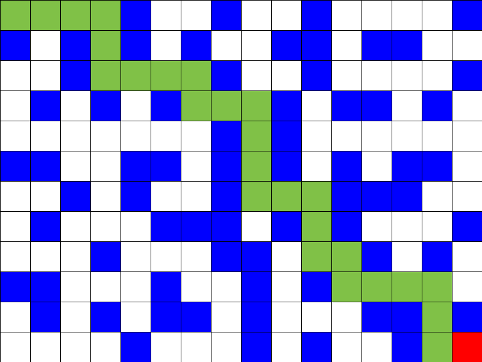
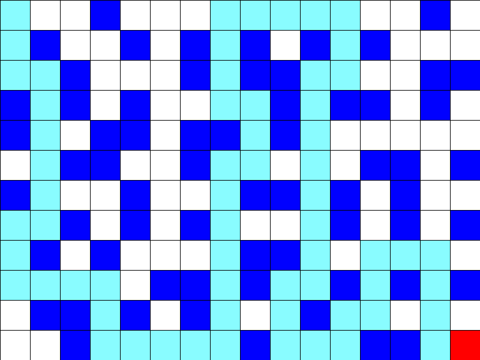
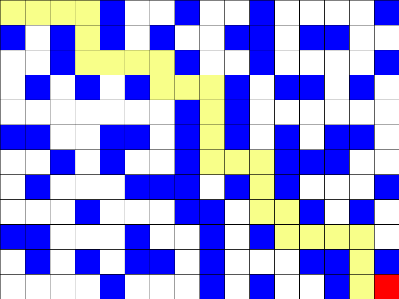
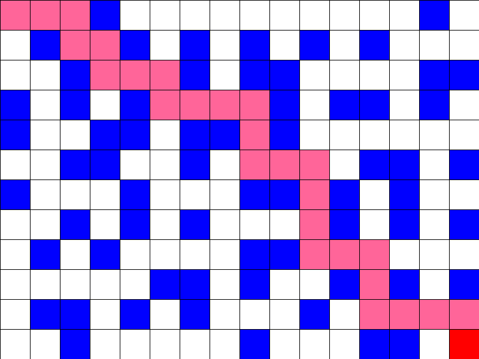
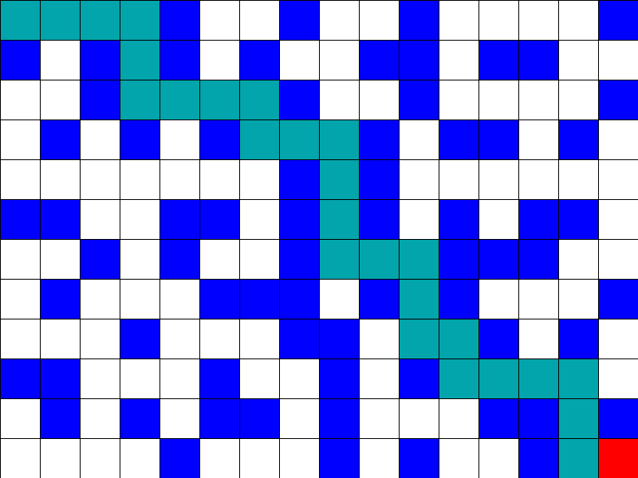
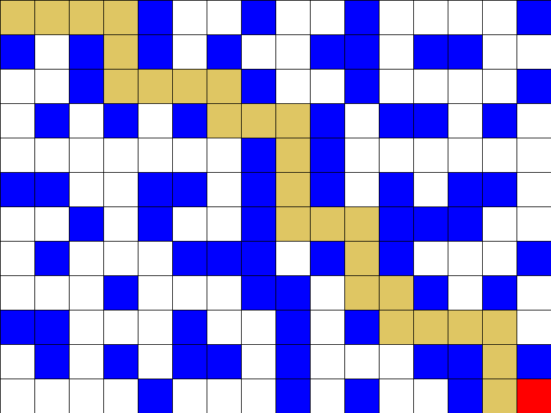

## Labirinto dinâmico com visualização interativa de algoritmos de busca

Um labirinto dinâmico foi criado para permitir que os usuários experimentem diferentes algoritmos de busca. O labirinto é gerado aleatoriamente pelo usuário, e os mesmos podem escolher um ponto de início e um ponto de destino. Em seguida, podem selecionar um algoritmo de busca, como busca em largura, busca em profundidade, busca A* e etc.

À medida que a busca ocorre, o caminho percorrido é destacado com cores diferentes. Isso permite que os usuários visualizem o processo de busca de forma clara e interativa.

Disciplina: SINF0042 - INTELIGÊNCIA ARTIFICIAL (2022.2 - TIND01)

<table>
  <tr>
    <td>
      <h4>Q-Learning</h4>
      
    </td>
    <td>
      <h4>Depth-First Search</h4>
      
    </td>
  </tr>
  <tr>
    <td>
      <h4>Breadth-First Search</h4>
      
    </td>
    <td>
      <h4>Greedy Best-First Search</h4>
      
    </td>
  </tr>
  <tr>
    <td>
      <h4>Uniform Cost Search</h4>
      
    </td>
    <td>
      <h4>A-star Search</h4>
      
    </td>
  </tr>
</table> 

## Running AI-Maze-Game with Docker and Xming on Windows

This guide provides step-by-step instructions for running the AI-Maze-Game application using Docker and Xming on a Windows machine.

### Prerequisites

Before you begin, make sure you have the following installed:

- Docker: [Install Docker for Windows](https://docs.docker.com/docker-for-windows/install/)
- Xming: Xming-6-9-0-31-setup.exe

### Instructions

1. Install Xming by running the `Xming-6-9-0-31-setup.exe` installer.
2. Open a terminal where the Dockerfile is located.
3. Build the Docker image by running the following command: `docker build -t projetoia .`
4. Run the Docker container with Xming by running the following command: `docker run -it --name projetoia -e DISPLAY=host.docker.internal:0 projetoia`
   - Note: Make sure to replace `projetoia` with the name of your Docker image if you used a different name in step 3.
5. Navigate to the Maze-IA directory by running the following command: `cd AI-Maze-Game/ && cd Maze-IA && ls`
6. Run the AI-Maze-Game application by running the following command: `python3 game.py`

## Install on Fedora 
#### Install the necessary dependencies to install Miniconda
1. `sudo dnf install -y wget bzip2 ca-certificates curl glib2 libXext libSM libXrender`
#### Download the Miniconda .sh file
2. `wget https://repo.anaconda.com/miniconda/Miniconda3-latest-Linux-x86_64.sh`
#### Install Miniconda in  /home/youruser/miniconda3
3. `bash Miniconda3-latest-Linux-x86_64.sh -b -p /home/youruser/miniconda3`
#### add Miniconda's bin directory to your PATH:
4. `echo 'export PATH="/home/youruser/miniconda3/bin:$PATH"' >> ~/.bashrc`
#### Activate the Conda base environment by running the following command:
5. `source /home/youruser/miniconda3/bin/activate`
6. `(base) [youruser]$ conda install -y -c conda-forge graph-tool`
7. `(base) [youruser]$ conda install -y -c conda-forge pygame`
8. `(base) [youruser]$ conda install -y numpy`

make the clone: `git clone https://github.com/NathanaelSantos/AI-Maze-Game.git`

`(base) [nathan]$ cd AI-Maze-Game/`
`(base) [nathan AI-Maze-Game]$ cd Maze-IA/`
`(base) [nathan Maze-IA]$ python3 game.py`

## How to Play
- Press the B key to activate or deactivate the "paint mode" (activated by default).
- You can draw new walls in the maze by clicking with the left button of the mouse, while the paint mode is activated.
- Press the S key to save a maze file. You can open it in the option "Import save".
- After drawing your maze, press the SPACE key to show the search algorithm menu.
- Select the algorithm by clicking with the left button of the mouse.
- Enjoy watching.

## Creators

|   |  |  |
| :---------------------:| :------------------------:| :-----------------------:|
|  |  |  |
| <b>Guilherme Santos Costa</b>   Bacharel em Sistemas de Informação | <b>José Nathanael Santos Matos</b>   Bacharel em Sistemas de Informação | <b>Pedro Antonio Santos Lima</b>   Bacharel em Sistemas de Informação |

### Disciplina: SINF0042 - INTELIGÊNCIA ARTIFICIAL (2022.2 - TIND01)
### Professor:
|   |  
| :---------------------:|
|  | width="100" /> |
| <b>ALCIDES XAVIER BENICASA</b>   Departamento: Sistemas de Informação - DSI/UFS |

## License
This project is licensed under the MIT License.

Remember to replace the example information with relevant information for your project.

